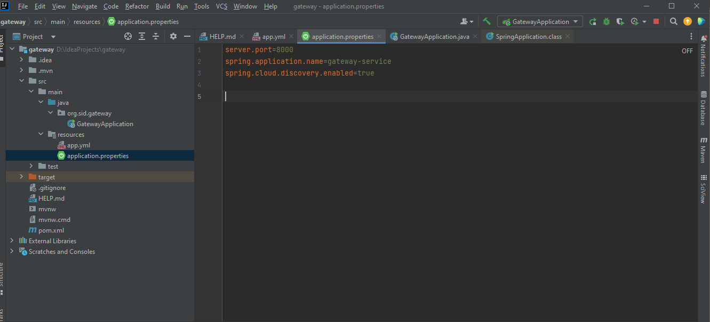
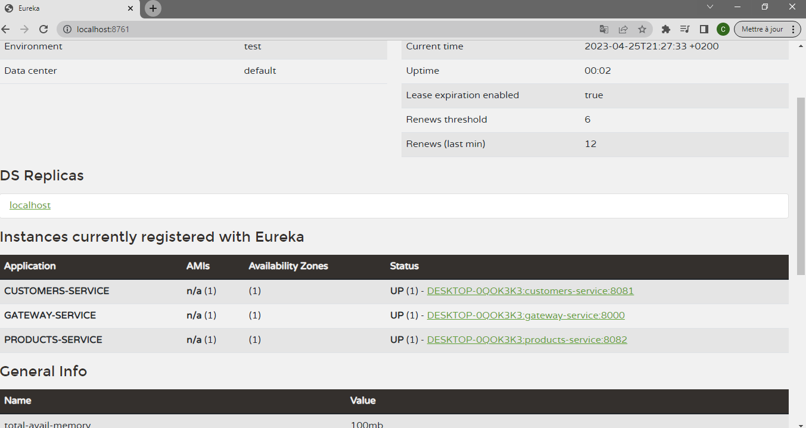
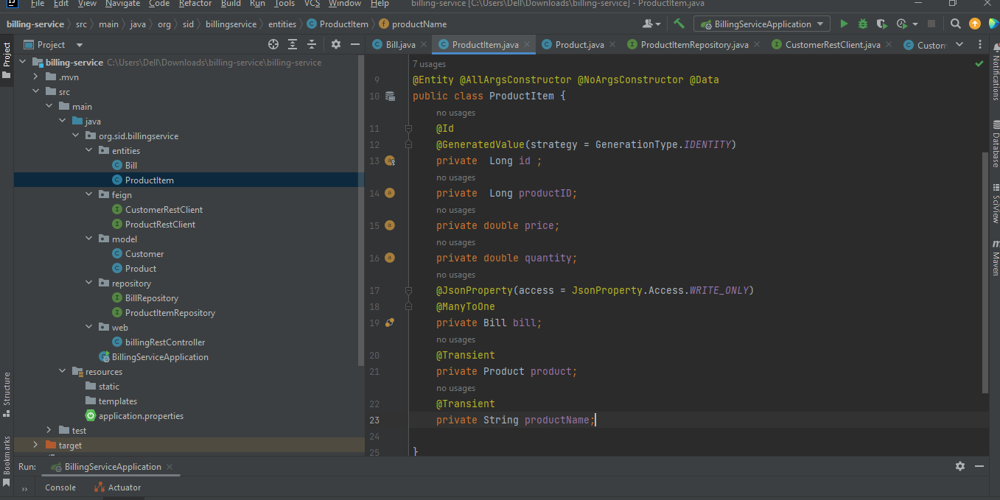

  
<h2>Activité pratique N°5 : Architecture Micro-services avec Spring Cloud</h2>
<h1>compte rendu</h1>
<h1>Beidja Cheikh</h1>
<h2>Master SDIA </h2>  
  
<h1>- Première partie : (Customer-Service, Inventory-Service, Spring Cloud Gateway, Eureka Discovery)</h1>
<h2>1. Créer le micro service Customer-service</h2> 
<h4>• Créer l’entité Customer </h4> 
  
<h4>• Créer l’interface CustomerRepository basée sur Spring Data </h4>
  
<h4>• Déployer l’API Restful du micro-service en utilisant Spring Data Rest </h4> 
<b>voici ce fait grace a lanotation @RepositoryRestResource</b></b>
  
<h3>.voici pour enregistré les customers dans le base de donnees</h3> 
  
<h2>• <b>Tester le Micro service</b></h2>  
<h3>- notre base de donner H2-console </h3>
  
<h3>- liste de customers </h3> 
  
<h3>- customer par son id </h3> 
  
<h3>- actuator pour consulté mon web service </h3> 
  
  
<h2>2. Créer le micro service Inventory-service </h2>
<h4>• Créer l’entité Product</h4> 
  
<h4>• Créer l’interface ProductRepository basée sur Spring Data</h4> 
  
<h4>• Déployer l’API Restful du micro-service en utilisant Spring Data Rest</h4> 
  
<h4>•L'enregistrement des produits</h4> 
  
<h2>•<b>Tester le Micro service</b></h2>  
<h3>- notre base de donner H2-console </h3>
  
<h3>- liste de produits </h3> 
  
<h3>-product par son id </h3> 
  
<h2>3. Créer la Gateway service en utilisant Spring Cloud Gateway</h2> 
  
<h3>1. Tester la Service proxy en utilisant une configuration Statique basée
sur le fichier application.yml</h3>
  
<h2>Test</h2>
<h4>list de customers </h4>
  
<h4>list de products </h4>
  
<h3>2. Tester la Service proxy en utilisant une configuration Statique basée
une configuration Java</h3>
<h4>configuration Statique basée une configuration Java</h4>
  
<h4>list de customers </h4>
  
<h4>list de products </h4>
  
<h3>4. Créer l’annuaire Registry Service basé sur NetFlix Eureka Server</h3>
  
  
<h3>5. Tester le proxy en utilisant une configuration dynamique de Gestion des routes vers les micro services enregistrés dans l’annuaire Eureka Server</h3>
  
  
<h4>list de customers </h4>
  
<h4>list de products </h4>
  
<h4> configuration dynamique</h4>
  
<h4>list de customers </h4>
  
<h4>list de products </h4>
  
<h4>product par son id </h4>
  
<h1>- Deuxième Partie : Billing Service avec Open Feign Rest Client</h1>
<h3>6. Créer Le service Billing-Service en utilisant Open Feign pour ommuniquer avec les services Customer-service et Inventory-service</h3>
<h4>- Entité Bill</h4>
  
<h4>- Entité ProductItm</h4>
  
<h4>- Customer model</h4>
  
<h4>- Product model</h4>
  
<h4>- BillRepository</h4>
  
<h4>- ProductItemRepository</h4>
  
<h4>- billingRestController</h4>
  
<h4>- L'interface CustomerRestClient</h4>
  
<h4>- L'interface ProductRestClient </h4>
  
<h4>- class BillingServiceApplication</h4>
  
<h4>- application.properties</h4>
  
<h4>- Eureka Discovery</h4>
  
<h4>- Entity Bill</h4>
  
<h4>- Entity Bill</h4>
  
<h4>- Entity PRODUCT_ITEM</h4>
  
<h4>-Test function getBillById()</h4>
  
<h4>-Test function getBillById() mes parfois cette fois gateway </h4>
  

